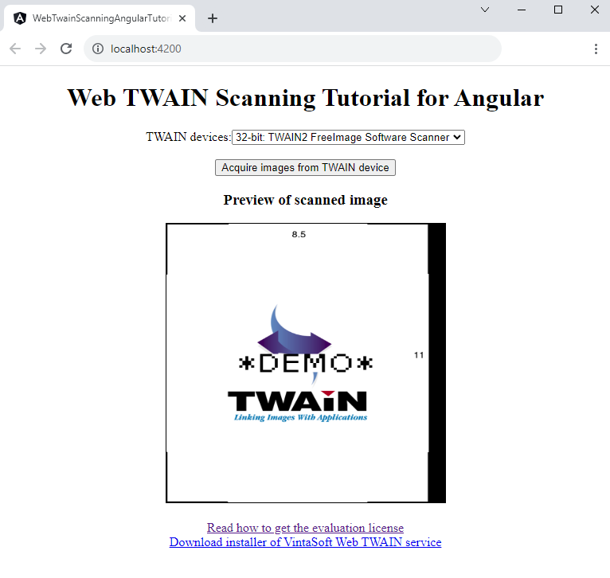

# Vintasoft Web TWAIN Scanning Tutorial for Angular

This project was generated with [Angular CLI](https://github.com/angular/angular-cli) version 16.2.0.
The Angular project uses <a href="https://www.vintasoft.com/vstwain-dotnet-index.html" target="_blank">VintaSoft TWAIN .NET SDK</a> and demonstrates how to work with TWAIN scanners on a Windows computer:
* Get the list of TWAIN devices
* Select TWAIN device
* Acquire images from TWAIN device
* Preview scanned images

## Screenshot


## Usage
If you want to read tutorial, which describes how to create this project from scratch, please read tutorial <a href="https://www.vintasoft.com/docs/vstwain-dotnet-web/Programming-Twain_Web-Tutorials-Acquire_images_from_TWAIN_scanner_in_Angular.html" target="_blank">Acquire images from TWAIN scanner in Angular application</a>.

If you want to use this ready-to-use project, please do the following steps:
1. Get the 30 day free evaluation license for <a href="https://www.vintasoft.com/vstwain-dotnet-index.html" target="_blank">VintaSoft TWAIN .NET SDK</a> as described here: <a href="https://www.vintasoft.com/docs/vstwain-dotnet-web/Licensing-Twain_Web-Evaluation.html" target="_blank">https://www.vintasoft.com/docs/vstwain-dotnet-web/Licensing-Twain_Web-Evaluation.html</a>

2. Update the evaluation license in "src\app\web-twain-scanning-angular-tutorial\web-twain-scanning-angular-tutorial.component.ts" file:
   ```
   Vintasoft.Twain.WebTwainGlobalSettingsJS.register('REG_USER', 'REG_URL', 'REG_CODE', 'EXPIRATION_DATE');
   ```

3. Install the dependencies:
   ```
   npm install --force
   ```

4. Execute the local web server and open Angular application in default web browser:
   ```
   ng serve -o
   ```

5. If VintaSoft Web TWAIN service is not installed on your Windows computer:
* Click "Download installer of VintaSoft Web TWAIN service" link on web page, download the installer and install VintaSoft Web TWAIN service to your local computer. VintaSoft Web TWAIN service serves HTTP-requests from VintaSoft TWAIN JavaScript API and allows to work with local TWAIN scanners.
* Reload web page and try to work with local TWAIN scanners.
